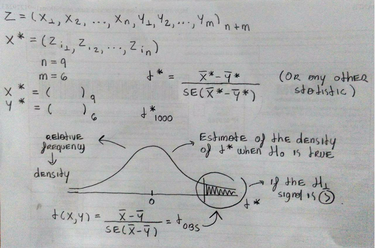

# Permutation tests {-}

***

- Resampling is used without replacement

They are applied for general hypotheses tests:

\[ X_{1}, ..., X_{n} \sim F
   \quad \text{ and } \quad
   Y_{1}, ..., Y_{m} \sim G \\
   H_{0} : F = G \quad \text{ vs.} \quad H_{1} : F \neq G
\]

- Permutation tests can be performed to check for independence, 
  homogeneity, tests for more than 2 groups, etc.

Let \(Z\) be the ordered set \(\{X_{1}, ..., X_{n}, Y_{1}, ..., Y_{m}\}\)
indexed by the indices
\(\nu = \{1, ..., n, n + 1, ..., n + m\} = \{1, ..., N\}\).

Under \(H_{0}\), the chance to select \(n\) elements of \(Z\) is

\[ \frac{1}{\binom{N}{n}} = \frac{n! m!}{N!}. \]

If \(\hat{\theta}(X, Y) = \hat{\theta}(Z, \nu)\) is a statistic, then the
*permutation distribution* of \(\hat{\theta}^{*}\) is the distribution of
the replicates

\begin{align}
 \left\{ \hat{\theta}^{*} \right\} &= \left\{
 \hat{\theta}(Z, \pi_{j}(\nu)), j = 1, ..., \binom{N}{n}
                          \right\} \\
                    & = \left\{ \hat{\theta}^{(j)} | \pi_{j}(\nu)
                                \text{ is a permutation of } \nu
                        \right\}.
\end{align}

The cdf of \(\hat{\theta}^{*}\) is given by

\[ F_{\theta^{*}}(t) = P(\hat{\theta}^{*} \leq t) =
   \binom{N}{n}^{-1} \sum_{j = 1}^{N} I\left(
                                       \hat{\theta}^{(j)} \leq t
                                       \right).
\]

Thus, if \(\hat{\theta}\) is applied to test a hypothesis and large
values of \(\hat{\theta}\) are significant, then the permutation test
rejects the null hypothesis when \(\hat{\theta}\) is large relative to
the distribution of the permutation replicates. The achieved significance
level (ASL) of the observed statistic \(\hat{\theta}\) is the probability

\[ P(\hat{\theta}^{*} \geq \hat{\theta}) =
   \binom{N}{n}^{-1} \sum_{j = 1}^{N} I\left(
                                       \hat{\theta}^{(j)} \geq t
                                       \right),
\]

where \(\hat{\theta} = \hat{\theta}(Z, \nu)\) is the statistic computed
on the observed sample. The ASL for a lower-tail or two-tail test based
on \(\hat{\theta}\) is computed in a similar way.

In practice, unless the sample size is very small, evaluating the test
statistic for all of the \(\binom{N}{n}\) permutations is computationally
excessive. An approximate permutation test is implemented by randomly
drawing a large number of samples without replacement.

## Approximate permutation test procedure {-}

1. Compute the observed test statistic
   \(\hat{\theta}(X, Y) = \hat{\theta}(Z, \nu)\)ν).
   
2. For each replicate, indexed \(b = 1, ..., B\):

    (a) Generate a random permutation \(\pi_{b} = \pi(\nu)\).
    
    (b) Compute the statistic
          \(\hat{\theta}^{(b)} = \hat{\theta}^{*}(Z, \pi_{b})\).

3. If large values of \(\hat{\theta}\) support the alternative, compute
   the ASL (the em- pirical p-value) by
   
   \[ \hat{p} =
      \frac{1 + \#\left\{
                   \hat{\theta}^{(b)} \geq \hat{\theta}
                  \right\}}{B + 1} = \frac{
      \left\{
       1 + \sum_{b = 1}^{B} I\left(
                             \hat{\theta}^{(b)} \geq \hat{\theta}
                             \right)
      \right\}}{B + 1}.
   \]

4. Reject \(H_{0}\) at significance level \(\alpha\) if
   \(\hat{p} \leq \alpha\).

(ref:permutation) A representation of a permutation test.
           
```{r fig.cap='(ref:permutation)', fig.align='center'} 

```

```{example name="Birth weight of chickens according 2 diets"}
```

```{r, comment=NA}
data("chickwts")

(x <- with(chickwts, sort(as.vector(weight[feed == "soybean"]))))
(y <- with(chickwts, sort(as.vector(weight[feed == "linseed"]))))

r = 100
z = c(x, y)
k = length(z)
t.s = vector("numeric", r)
t = t.test(x, y)$statistic
for (i in 1:r){
    ks = sample(k, size = length(x), replace = FALSE)
    t.s[i] = t.test(z[ks], z[-ks])$statistic
}
(p <- mean(c(t, t.s) >= t))
```

***
